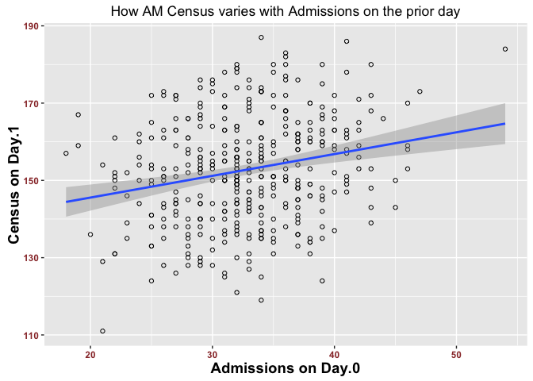

Charlton Census
================

### 7 AM Census

Below there's a histogram that shows the distribution of the **7 AM Census** between 9/2015 to 9/2016 spanning a period of 13 months. Most of the values fall between 150 to 170 patients at 7 am (I believe the pending admissions are not included in the 7 AM Census). This distribution seems to follow a "normal distribution" with a **"Mean value"** of **152.8** and a *97.5 %* **confidence interval** ranging between **151.1** and **154.4** (Very narrow confidence interval due to the fact that the sample contains 396 days). The utility of the confidence interval lies in the fact that we can calculate the average 7 AM census between October 2016 and now; and if it shows a value that doesn't fall into that confidence interval range, it means there was a "change" or "something happened" that's leading to a higher census, or simply put the new census values can't be attributed to a random variation.

    ## 
    ##  Shapiro-Wilk normality test
    ## 
    ## data:  cc$AM.Census
    ## W = 0.99515, p-value = 0.2521

### Total Daily Encounters

The histogram below shows the distribution of the **Total Daily Encounters** (I guress it includes admissions on top of the 7AM census). The 97.5% **confidence interval** is **171.1** to **174.4**. Again, as previously mentioned, if the average total daily encounter from october 2016 to now doesn't fall within that range, it means there was a "change" that happened and the probability for that change to happen at random is less than 2.5%.

### Daily Discharges

The Daily discharges bulk centers between **25** to **40** discharges per day. Average daily discharge is **31.7**

### Daily Admissions

Interestingly and thankfully, daily admissions tend to match daily discharges with the bulk of admissions ranging between 25 to 40. The *average daily admission* is **32.8** slightly higher than the average daily discharges of 31.7. The 97.5% confidence interval is also narrow and ranges between 32.1 to 33.4. It has the same usefulness for the same reasons mentioned above.

### Admissions per Weekday

Below we see the average number of admisions per weekday. As we will see later the minimal drop of admissions on weekends doesn't match the greater drop in discharges over the weekend.

### Discharges per Weekday

Below we see the average discharges per weekday. As mentioned, above the drop in discharges over the weekend outmatches the drop in admissions over the weekend.

### Daily average of AM Census and Total Encounters per Weekday

As will be seen below, the heaviest days in terms of *AM Census* and *Daily Encounters* are Monday, Tuesday and Wednesday.

The 3 graphs below show no significant uptrend or downtrend in Admissions, Daily Encounters or Discharges over the period of 13 months. However, the period around January 2016 showed an uptick in *Admissions* and *Daily Encounters* not matched by "Discharges"

### Relationships between different variables.

Below I show the relationship between a few variables like admissions, discharges and am census. **Day.1** refers to tomorrow. **Day.0** refers to *today* when we are trying to figure out *Day.1* census.

We see below a correlation of 0.22 between admissions on Day.0 and and AM Census on Day.1

    ## [1] 0.2249423

We see below a mediocre correlation of 0.3 between Admissions on Day.0 and total Encounters on Day.1. In other words Admissions on Day.0 account for 30% of the variability of total encounters on Day.1.

    ## [1] 0.3000713

We see below a poor correlation of 0.16 between Admissions on Day.0 and Discharges on Day.1. *That means a busy day of Admissions will not be necessarily followed by a busy day of discharges.*

    ## [1] 0.1643574

The only 2 variables that will be available by 5 pm to 7 pm on Day.0 are "7AM Census" and "Discharges". For instance "Total Encounters"" on Day.0 wont be available by 7 pm since there will be another 5 hours left for admission on Day.0, the same concept applies to "Admissions". As we see below, luckily we have a decent positive correlation between **AM Census on Day.0** *and* **AM Census on Day.1** and a weaker negative correlation between **AM Census on Day.1** and **Discharges on Day.0**.

> Therefore we can try to use these 2 variables *AM Census on Day.0* and *Discharges on Day.0* to predict *AM Census" on Day.1*.

### Some more charts

The chart below shows a side by side bar chart on Encounters and Discharges.

The 3 charts below show the significant differnce between *Discharges* on weekdays and weekdens, but the differnce in less stark in *Total encounters* and *AM Census*.

Over that period of 13 months between 9/2015 and 9/2016 (9/2016 included), there was 86 days on which a back up was called. I found this interesting since now we have a back up almost every day now. I was curious to find if the percentage of the discharged patients of the 7 AM Census increases with backups; the barplot below shows a very slight increased percentage of discharged patients when Backup is present.

    ## [1] 86

### Gross conclusion:

#### Census

The increase in Census that occured between October 2016 and now may be a *new normal* Census different than the one analysed above or it may be a random upward variation that will be offset by the decrease in Census that we are seeing starting now in February 2016. We can tell by averaging the mean of the current census between October 2016 and probably May or June 2017 and see if it falls back to the expected range calculated above in the confidence interval.

#### Staffing

The busiest days in Census and Encounters are Monday, Tuesday and Wednesday. It may be the result of decreased discharge over the weekends. So Backups are most likely to help during the first 3 days of the week.

#### Prediction

Based on the linear regression shown above between "Day.1 AM Census" and "Day.0 AM Census" with "Day.0 Discharges", I generated the following regression:

> Expected Tomorrow's AM Census = (0.84.Toay's census) - (0.65.Today's discharges) + 45.61

*(0.84 multiplied by today's census minus 0.65multiplied by today's discharges than add the constant 45.61)*

I dont expect this formula to predict miracles (Discharges count is not reliable since a lot of patients who are discharged on Day.0 are still part of the Census on Day.1) but it's a least an attempt.
